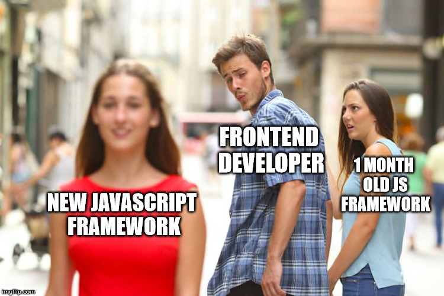

# DENAVRIN.js

> Um framework Javascript para a todos governar!

[][anavrin-github]

- Um framework para desenvolvimento backend com baterias inclusas.
- Projeto de iniciativa propria para aprimorar meus conhecimentos em javascript e, posteriormente, ser utilizado em futuros projetos.

# Techs Utilizadas

- Typescript
- DENO.js

# Uso do framework

- Na pasta myapp há um exemplo de uma aplicação construída com o framework
- Caso tenha dúvidas, consulte nossa [wiki](wiki)

# Etapas do Projeto

- [x] Criando a base do framework
- [x] Criando sistema de rotas
- [x] Criando sistema de camadas MVC
- [x] Criando sistema de middlewares de permissão
- [ ] Criando sistema de projetos e apps
- [ ] Implementando as modificações para o sistema de apps e projetos genéricos
- [ ] Desenvolvendo um projeto para testar o framework
- [ ] Instalando nosso framework globalmente
- [ ] Utilizando sqlite3 como banco de dados
- [ ] Utilizando denodb para multiplos bancos de dados
- [ ] Criando uma camada de banco de dados
- [ ] Finalizando camada de banco de dados
- [ ] Criando sistema de templates HTML
- [ ] Utilizando o denjucks como sistema de templates
- [ ] Integrando o denjucks ao nosso framework
- [ ] Integrando o OAK ao projeto
- [ ] Criando o banco e sincronizando as tabelas
- [ ] Finalizando o CRUD
- [ ] Limpeza final e refactor do framework
- [ ] Criando servidor de arquivos estaticos e integrando com projeto copy

## Histórico de lançamentos

- 0.0.1
  - Trabalho em andamento

## Quem sou eu?

Uma startup especializada em soluções de Data Science, meu nome é [ANAVRIN](anavrin-github)

## Contribuidores

- Principal:
  [David Borges](david-linkedin)
- Outros:
  [José Mário](ze-gitlab) (@jmsj777 em toda a web)

## Contributing

1. Faça o _fork_ do projeto
2. Crie uma _branch_ para sua modificação (`git checkout -b feature/qualquer`)
3. Faça o _commit_ (`git commit -am 'Add some qualquer'`)
4. _Push_ (`git push origin feature/qualquer`)
5. Crie um novo _Pull Request_

[david-linkedin]: https://www.linkedin.com/in/david-borges-31891310a
[anavrin-github]: https://github.com/anavrin-tech
[ze-gitlab]: https://gitlab.com/jmsj777
[wiki]: https://github.com/anavrin-tech/my-framework/wiki
